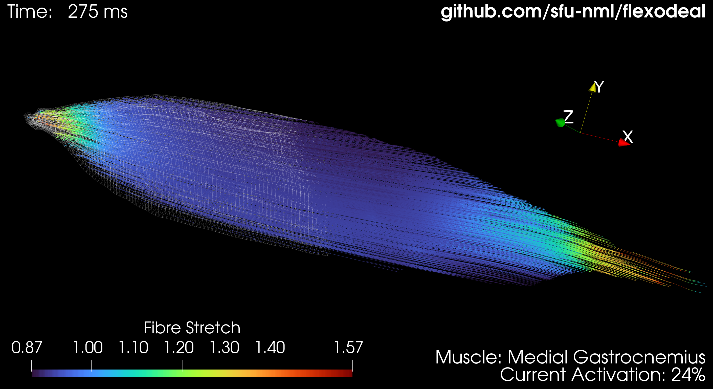
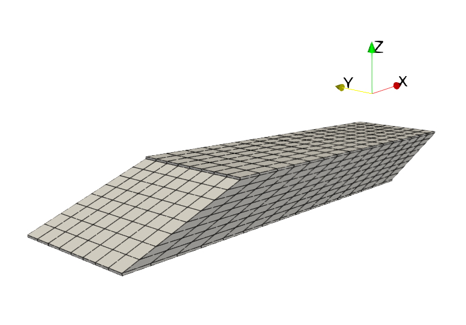
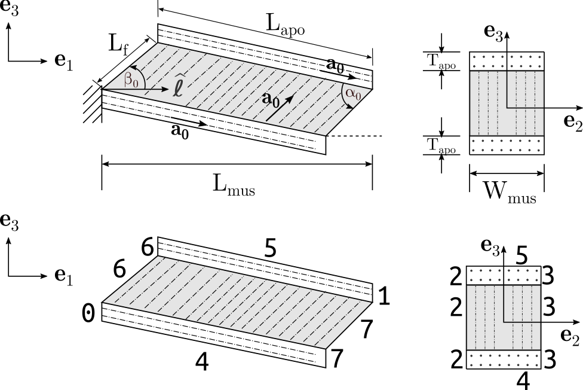

# What is Flexodeal?


Watch the video! [https://www.youtube.com/watch?v=UtFPTZ7JW0w](https://www.youtube.com/watch?v=UtFPTZ7JW0w)

Flexodeal is a computational library designed to perform three-dimensional dynamic or quasi-static deformations of skeletal muscle tissue using a Hill-type muscle model and the finite element library [deal.II](https://www.dealii.org).

The underlying material properties and numerical algorithms, are described in the following paper:

* Almonacid, J. A., Domínguez-Rivera, S. A., Konno, R. N., Nigam, N., Ross, S. A., Tam, C., & Wakeling, J. M. (2024). A three-dimensional model of skeletal muscle tissues. SIAM Journal on Applied Mathematics, S538-S566. [https://doi.org/10.1137/22M1506985](https://doi.org/10.1137/22M1506985)

This coding framework has been used in the following studies:

* Ross, S. A., Domínguez, S., Nigam, N., & Wakeling, J. M. (2021). The Energy of Muscle Contraction. III. Kinetic Energy During Cyclic Contractions. Frontiers in Physiology, 12(April), 1–16. https://doi.org/10.3389/fphys.2021.628819

* Konno, R. N., Nigam, N., & Wakeling, J. M. (2021). Modelling extracellular matrix and cellular contributions to whole muscle mechanics. PLoS ONE, 16(4 April 2021), 1–20. https://doi.org/10.1371/journal.pone.0249601

* Ryan, D. S., Domínguez, S., Ross, S. A., Nigam, N., & Wakeling, J. M. (2020). The Energy of Muscle Contraction. II. Transverse Compression and Work. Frontiers in Physiology, 11(November), 1–15. https://doi.org/10.3389/fphys.2020.538522

* Wakeling, J. M., Ross, S. A., Ryan, D. S., Bolsterlee, B., Konno, R., Domínguez, S., & Nigam, N. (2020). The Energy of Muscle Contraction. I. Tissue Force and Deformation During Fixed-End Contractions. Frontiers in Physiology, 11, 1–42. https://doi.org/10.3389/fphys.2020.00813

* Domı́nguez S. From eigenbeauty to large-deformation horror. Ph.D. Thesis, Simon Fraser University. 2020. Available from: http://summit.sfu.ca/item/20968

* Ross, S. A., Ryan, D. S., Dominguez, S., Nigam, N., & Wakeling, J. M. (2018). Size, history-dependent, activation and three-dimensional effects on the work and power produced during cyclic muscle contractions. Integrative and Comparative Biology, 58(2), 232–250. https://doi.org/10.1093/icb/icy021

* Rahemi, H., Nigam, N., & Wakeling, J. M. (2015). The effect of intramuscular fat on skeletal muscle mechanics: implications for the elderly and obese. Journal of The Royal Society Interface, 12(109), 20150365. [https://doi.org/10.1098/rsif.2015.0365](https://doi.org/10.1098/rsif.2015.0365)

* Rahemi, H., Nigam, N., & Wakeling, J. M. (2014). Regionalizing muscle activity causes changes to the magnitude and direction of the force from whole muscles—a modeling study. Frontiers in physiology, 5, 298. [https://doi.org/10.3389/fphys.2014.00298](https://doi.org/10.3389/fphys.2014.00298)

# Installation

1. Download and compile deal.II (available for Linux and MacOS). The latest version of Flexodeal works with deal.II v9.5.1, though users with deal.II v9.6 have also been able to use Flexodeal without issues (yet).

2. Download the [latest release](https://github.com/javieralmonacid/flexodeal/releases) of Flexodeal using the .zip file or simply clone this repository (`git clone`) to get bleeding edge updates by simply invoking ```git pull```.

3. Go to the directory where you extracted or cloned Flexodeal and compile using CMake: ```cmake . -DCMAKE_BUILD_TYPE=Release -DDEAL_II_DIR=<path/to/deal.II>```. This will set the appropriate dependencies to then ```make``` the code.

# How to use it

In general, Flexodeal should be treated as modelling framework and not as a "works out of the box" solution. While some tensile experiments can be performed with minimal modifications, you should also be prepared to modify the code directly. Learn what to expect in terms of coding by learning more about how deal.II works: [https://www.dealii.org/current/doxygen/deal.II/Tutorial.html](https://www.dealii.org/current/doxygen/deal.II/Tutorial.html).

## Case 1: Using the default geometry

As usual in deal.II applications, Flexodeal requires a structured mesh made of hexahedral elements (hanging nodes are not supported at the moment). We call each hexahedral element in the mesh a *voxel*.

By default, the computational domain is set to a simplified human medial gastrocnemius muscle, as previously described in:

* Ross, S. A., Domínguez, S., Nigam, N., & Wakeling, J. M. (2021). The Energy of Muscle Contraction. III. Kinetic Energy During Cyclic Contractions. Frontiers in Physiology, 12(April), 1–16. https://doi.org/10.3389/fphys.2021.628819

Below is an overall view of the meshed computational domain:



The geometry can be described using the parameters below (see the `parameters.prm` file for their numeric values):



- $\widehat{\ell}$: line of action vector, currently set at <1,0,0> (i.e. aligned with the x axis).
- $L_{mus}$ [m]: length of the muscle (in the direction of the line of action).
- $L_{apo}$ [m]: length of the aponeurosis.
- $W_{mus}$ [m]: width of the muscle and aponeurosis layers.
- $T_{apo}$ [m]: thickness (height) of the aponeurosis layer
- $\beta_0$ [deg]: initial pennation angle, considered between the line of action and the direction of the fibres.

Other quantities, such as the initial fibre length $L_f$ and the angle between the aponeurosis and the muscle fibres $\alpha_0$ are computed automatically from trigonometric relations:

$$\alpha_0 = \sin^{-1} \left( \dfrac{L_{mus}}{L_{apo}} \sin(\beta_0) \right); \quad \theta_0 := \alpha_0 - \beta_0, \quad L_f = L_{apo} \dfrac{\sin(\theta_0)}{\sin (\beta_0)}.$$

Fibre orientations are set at each quadrature point (QP) as follows:

$$\mathbf{a}_0(\mathbf{X}) = \begin{cases}
\langle \cos(\beta_0), 0, \sin(\beta_0)\rangle, & \text{at muscle QPs}, \\
\langle \cos(\theta_0), 0, -\sin(\theta_0)\rangle, & \text{at aponeurosis QPs}.
\end{cases}$$

**About quadrature points (QPs):** Quadrature points are used to evaluate these integrals approximately by placing "evaluation points" within each element and using weights associated with these points to compute the integral. This helps in ensuring that the element-level calculations (like stiffness or mass matrices) are accurately represented in the global system, which is essential for the solution of the finite element problem. 

The number of quadrature points is determined by the *order* of the quadrature rule. Flexodeal uses a [Gaussian quadrature](https://en.wikipedia.org/wiki/Gaussian_quadrature) rule and the order is specified in the ```parameters.prm``` file (see ```set Quadrature order``` in the ```Finite element system``` subsection). Below is a guideline to choose the correct order based on the chosen polynomial degree and whether the simulation is quasi-static or dynamic:

| ```set Polynomial degree``` | ```set Type of simulation``` | ```set Quadrature order```| Number of QPs per voxel |
|:---------------------------:|:----------------------------:|:-------------------------:|:-----------------------:|
| 1 | quasi-static | 2 | 8   |
| 1 | dynamic      | 2 | 8   |
| 2 | quasi-static | 3 | 27  |
| 2 | dynamic      | 4 | 64  |
| 3 | quasi-static | 4 | 64  |
| 3 | dynamic      | 5 | 125 |

### Running the code

To run Flexodeal using this default geometry and the default activation and strain parameters (corresponding to a 1-second cyclic contraction), simply run `make` and then
```
./flexodeal
```
You may use the `-OUTPUT_DIR` flag to change the directory in which the results will be stored.

### Using variable properties through a quadrature point file

You can set custom fibre orientations and intramuscular fat fractions at each quadrature point using a **quadrature point file** (which we will refer to as a "QP file"). 

The first step in constructing the QP file is to generate the list of QPs:
```
./flexodeal -QP_LIST_ONLY
```

This should generate the file ```qp_data.backup.qp.csv```. The file will only contain four columns: ```qp_x```, ```qp_y```, ```qp_z```, and `tissue_id` denoting each one of the components of the QP and its material characteristics.

Tissue ID is the way we differentiate muscle tissue from others, such as aponeurosis and tendon. As of this version of Flexodeal, the following IDs can be identified in tissue:

| Tissue                             | ID  | 
|:----------------------------------:|:---:|
| Muscular                           |  1  |
| Aponeurosis (internal or external) |  2  |
| Tendon                             |  3  |

Tissue IDs are assigned to each QP depending on the material ID (also called "physical ID") of each in which the QP is located. These material IDs are set **at the time the mesh is constructed**.

The next step is to attach physiological properties to each one of these points. To do so:
1. Create a copy of your backup file (recommended),
2. Edit *this new* CSV file and insert a new column with the name of the property and the value for each point. At the moment, the following properties are supported (written as ```column header```: description [units]):
* ```max_iso_stress_muscle```: maximum isometric stress of muscle [Pa].
* ```muscle_fibre_orientation_x```: Initial fibre orientation vector (normalized), x component.
* ```muscle_fibre_orientation_y```: Initial fibre orientation vector (normalized), y component.
* ```muscle_fibre_orientation_z```: Initial fibre orientation vector (normalized), z component.
* ```fat_fraction```: Fraction of intramuscular fat present in muscle. It is a number between 0 and 1.

> :warning: *The order of these columns does not matter, however, it is important to use the correct header name, otherwise, the code will throw an error.*

************** Review any of the QP files in the  ```qp_files``` folder to see how the QP file should look like. 

An example of what the QP file should look like after adding these columns is available at `qp_data_2.qp.csv`. The following call is equivalent to `./flexodeal`:
```
./flexodeal -QP_FILE=qp_data_2.qp.csv
```

### Adding new columns easily

In general, you must **avoid editing** the QP file in software such as LibreOffice Calc or Microsoft Excel (reading/viewing is still okay), because these programs can truncate important significant digits at the time of saving the CSV file. 

To add columns to the QP files, you can use the bash file ```add_columns_to_qp_file.sh``` to add the necessary columns to the CSV file. For instance, the following command:
```
bash add_columns_to_qp_file.sh quadrature_point_data.csv max_iso_stress_muscle 200000 muscle_fibre_orientation_x 0.939692620785908 muscle_fibre_orientation_y 0 muscle_fibre_orientation_z 0.342020143325669 fat_fraction 0
```
would add the columns ```max_iso_stress```, ```muscle_fibre_orientation_x```, ```muscle_fibre_orientation_y```, ```muscle_fibre_orientation_z```, and ```fat_fraction``` to the file ```quadrature_point_data.csv``` with values 200000, 0.939692620785908, 0, 0.342020143325669, and 0, respectively. However, if different tissues have different fibre orientations (for instance), you might need to further modify this file using Matlab's `readtable` function or Python's `read_csv` function from the `pandas` library. As an example, check the Matlab script `other_resources/add_columns_to_qp_file_with_aponeurosis.m`.

## Case 2: Using other geometries

If you decide to use a geometry (or mesh) different than the provided one, then some properties, such as boundary IDs, might need to be set differently in the `flexodeal.cc` file. Hence, it is highly likely you'll need to do some hard coding, especially in the `Solid<dim>::make_constraints` function.

### 1. Setting up the quadrature point table (requires a mesh)

Here, the use of a QP file is mandatory. To generate this file:
1. Generate the list of quadrature points. If your mesh is called `my_mesh.msh`, then the command `./flexodeal -MESH_FILE=my_mesh.msh -QP_LIST_ONLY` will generate the list of quadrature points for this mesh. The file will be called `my_mesh.backup.qp.csv`.
2. Insert the appropriate columns as described in Case 1: Using the default geometry. We recommend doing this in a copy of your `my_mesh.backup.qp.csv` file (say, `my_mesh.qp.csv`) and not directly in the backup file.
3. Fill up the columns as desired, either by using the `add_columns_to_qp_file.sh` script or through other means (Python pandas, MATLAB).

#### Different meshes require different QP files

It is important to note that the number of QPs depends directly on the amount of voxels in the mesh. Therefore, different meshes will require you to generate different QP files.

### 2. Set up markers

You may set a list of markers to track displacements at different points in the geometry. The list (by default, `markers.dat`, with the filename set in `parameters.prm` in the `Measuring locations` subsection) has four columns: the first one is a label and the other are the three components of the marker. Note that, in this context, a marker is a mesh vertex that contains displacement degrees of freedom. Therefore, every marker **must** be a vertex in the mesh. Check the file `markers.dat` to see the structure of this file. **If you do not know the location of any markers, just create an empty file with the name as given in `set Markers list file` inside `parameters.prm`.**

### 3. Running the code

Once you have set up your quadrature point file, you may run Flexodeal as
```
./flexodeal -MESH_FILE=my_mesh.msh -QP_FILE=my_mesh.qp.csv
```
This assumes that your activation profile is given in ```control_points_activation.dat```, your boundary strain in ```control_points_strain.dat``` and your parameters in ```parameters.prm```. If you want to use files with other names, you can use flags to override these default settings:
```
./flexodeal -MESH_FILE=my_mesh.msh -QP_FILE=my_mesh.qp.csv -PARAMETERS=other_parameters.prm -ACTIVATION=another_activation.dat -BDY_STRAIN=another_boundary_strain.dat
```
You can also change the output directory by adding the ```-OUTPUT_DIR``` flag:
```
./flexodeal -MESH_FILE=my_mesh.msh -QP_FILE=my_mesh.qp.csv -PARAMETERS=other_parameters.prm -ACTIVATION=another_activation.dat -BDY_STRAIN=another_boundary_strain.dat -OUTPUT_DIR=my_favourite_name_for_a_folder
```

### 4. Output using binary files: what they are and how to read them

A binary file is a file that contains data in a format that is not directly readable by humans. Unlike text files, which store data as plain text (ASCII or Unicode), binary files store data in raw binary format, which is optimized for computer processing rather than human readability.

Each of these files (which are written at each time step) contains a two-dimensional array (number of quadrature points) x (number of columns),
where each column represents a different quantity of interest and each row is a different quadrature point.

Since these are rather large files, these are **not** output by default. To export these files, set in `parameters.prm`:
```
subsection Output binary files
    set Output binary files main variables = true
    set Output binary files tensors = true
end
```

The first type of files exports binary files named `cell_data_main-3d-XYZ.data`, where XYZ is the time step. Each one of these files contains the following columns (20 in total):
1. `qp_x` (X component of the quadrature point in the reference configuration)
2. `qp_y` (Y component of the quadrature point in the reference configuration)
3. `qp_z` (Z component of the quadrature point in the reference configuration)
4. `JxW` (dilation J x quadrature point weight)
5. `det_F` (determinant of the deformation tensor)
6. `u1` (First component of current displacement)
7. `u2` (Second component of current displacement)
8. `u3` (Third component of current displacement)
9. `v1` (First component of current velocity)
10. `v2` (Second component of current velocity)
11. `v3` (Third component of current velocity)
12. `p` (Current pressure)
13. `D` (Current dilation)
14. `stretch` (Fibre stretch)
15. `stretch_bar` (Fibre stretch, isochoric component)
16. `strain_rate` (Fibre strain rate, normalized)
17. `strain_rate_bar` (Fibre strain rate, normalized, isochoric component)
18. `orientation_x` (X component of current fibre orientation)
19. `orientation_y` (Y component of current fibre orientation)
20. `orientation_z` (Z component of current fibre orientation)
21. `tissue_id` (Tissue ID of QP)

The second type of files are named `cell_data_tensors-3d-XYZ.data` and contains the following columns (see the comments in the parameter file to view the exact name of each column, 68 columns in total):
- Column 1: `qp_x`
- Column 2: `qp_y`
- Column 3: `qp_z`
- Column 4: `Jxw`
- Column 5: `det_F`
- Columns 6-14: `F_i_j`, the (i,j) component of the deformation tensor `F`
- Columns 15-23: `tau_i_j`, the (i,j) component of the Kirchhoff stress `tau`
- Columns 24-32: `tau_vol_i_j`, the (i,j) component of `tau_vol`
- Columns 33-41: `tau_iso_i_j`, the (i,j) component of `tau_iso`
- Columns 42-50: `tau_muscle_active_i_j`, the (i,j) component of `tau_muscle_active`
- Columns 51-59: `tau_muscle_passive_i_j`, the (i,j) component of `tau_muscle_active`
- Columns 60-68: `tau_muscle_base_i_j`, the (i,j) component of `tau_muscle_base`
- Column 69: `tissue_id` (Tissue ID of QP)

To read these files in Matlab, use the following function:
```
function df = read_binary(filename, ncols)
% READ_BINARY Transforms a the contents of a binary file into a matrix
%
% df = read_binary(filename, cols) reads the file "filename" assuming that
% it will find a vector of "float32" numbers. Assuming this vector has N
% elements, the array is then reshaped to a N/ncols x ncols matrix, where
% ncols is the number of columns the array is expected to have.

fid = fopen(filename);
df = fread(fid, Inf, "float32");
df = reshape(df', ncols, length(df)/ncols)';
fclose(fid);
```

## What am I running and how long should that take?

When calling `./flexodeal` right after `make`ing the software, you are running a dynamic, cyclic contraction (1 second of simulation time) of an idealized human medial gastrocnemius. Using `set Type of simulation = dynamic` (i.e. with force-velocity properties) would run the whole simulation in about 8-10 minutes using an Intel i5-9600K (3.70 GHz x 6) processor. On the other hand, setting `set Type of simulation = quasi-static` (i.e. _without_ force-velocity properties) runs the code in about 5-6 minutes. Both computations write the following amounts of data:
- About 36 MB if `set Output binary files main variables = false` and `set Output binary files tensors = false`,
- About 231 MB if `set Output binary files main variables = true` and `set Output binary files tensors = false` (this is the option by default in the parameters file),
- About 869 MB if `set Output binary files main variables = true` and `set Output binary files tensors = true`.

